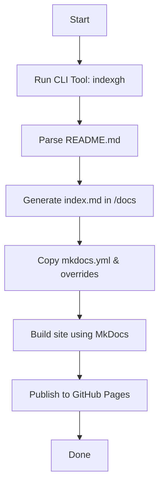

# Project Architecture

This document describes the overall architecture and flow of the `index-gh-pages` CLI tool.

## Overview

The tool provides a simple and automated way to convert `README.md` to `index.md` and generate MkDocs documentation, with custom overrides and publishing support.

## Flow Diagram

## Components

- `generate_project_config.py`: Extracts project metadata into a JSON config
- `generate_setup_files.py`: Generates `setup.py` and `pyproject.toml` based on config
- `generate_mkdocs_yml.py`: Dynamically generates `mkdocs.yml` using Jinja2 template
- `publish.py`: Publishes site to GitHub Pages after successful build

## Notes

- Supports override files (e.g., custom theme, logo, favicon)
- Easily extensible with plugins and additional templates
