# 🏗️ System Architecture – index-gh-pages

This document describes the internal architecture and execution flow of the `indexgh` CLI tool.

## 🎯 Overview

`indexgh` is a CLI utility that transforms a `README.md` into `index.md`, prepares MkDocs documentation, and optionally deploys it to GitHub Pages.

---

## 🧭 Execution Flow

```mermaid
flowchart TD
    A[🚀 Run indexgh CLI] --> B{🤔 User selects an option}
    B -->|1| C[📦 Build documentation]
    B -->|2| D[🧽 Prepare docs only]
    B -->|3| E[🌐 Serve locally]
    B -->|4| F[🚀 Deploy to GitHub Pages]
    B -->|5| G[🔎 Show version]
    C --> H[🛠️ Generate index.md]
    C --> I[📄 Copy mkdocs.yml]
    C --> J[🏗️ Run mkdocs build]
    F --> K[🔁 Git add/commit/push to gh-pages branch]
```



## 🧩 Components
cli.py: Entry point for the CLI, handles user choices.

builder.py: Core logic for generating index.md, copying config, and building docs.

publisher.py: Logic for GitHub Pages deployment.

project_config_template.json: Template for dynamic project configuration.

mkdocs.yml: Dynamically generated MkDocs configuration file.

📁 Folder Structure
```plaintext
index-gh-pages/

├── cli.py
├── builder.py
├── publisher.py
├── config/
│   └── project_config_template.json
├── templates/
│   └── mkdocs.yml.j2
├── screenshots/
│   └── demo.gif
└── ...
└── README.md
```

## 📦 Output
docs/index.md: Generated from README.md

site/: Built MkDocs site

gh-pages branch: Deployed static site


